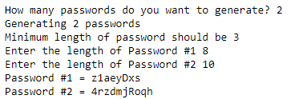

## Task: Debugging code  
  
Let's say your company is trying to implement a "password generator" or "suggested password", similar to [LastPass](https://www.lastpass.com/features/password-generator). 

Your task is to find and solve all the bugs to get the output looking like this.  

### You will be working with a modified version of abhishek305's code made to introduce bugs found [HERE](./password_generator.py).
> Original code from [abhishek305's GitHub](https://github.com/abhishek305/Password-Generator-in-python/blob/master/Password%20Generator.py)
