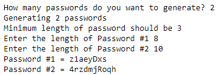

## Task: Debugging code  
  
Let's say your company is trying to implement a "password generator" or "suggested password", similar to [LastPass](https://www.lastpass.com/features/password-generator). 

Your task is to find and solve all the bugs to get the output looking like this.  


### This is a modified version of [abhishek305's](https://github.com/abhishek305) code made to introduce bugs.
> Original code from [abhishek305's GitHub](https://github.com/abhishek305/Password-Generator-in-python/blob/master/Password%20Generator.py)

```python
import random

def replaceWithUppercaseLetter(password):
    for i in range(random.randrange(0,3)):
        replace_index = random.randrange(len(pword)//2,len(pword))
        pword = pword[0:replace_index] + pword[replace_index].upper() + pword[replace_index:]
        return pword

def generatePassword(pwlength):

    alphabet = "abcdefghijklmnopqrstuvwxyz"

    passwords = [] 

    for i in pwlength:
        
        password = "" 
        for j in range(i):
            next_letter_index = random.randrange(len(alphabet))
            password = password + alphabet[next_letter_index]
        
        password = replaceWithNumber(password)
        password = replaceWithUppercaseLetter(password)
        
        passwords.append(password) 
    
    return passwords


def replaceWithNumber(pword):
    for i in range(random.randrange(1,3)):
        replace_index = random.range(len(pword)/2)
        pword = pword[0:replace_index] + str(random.randrange(10)) + pword[replace_index:]
        return pword


def main():
    
    numPasswords = input("How many passwords do you want to generate? ")
    
    print("Generating " +str(numPasswords)+" passwords")
    
    passwordLengths = []

    print("Minimum length of password should be 3")

    for i in range(numPasswords):
        length = int(input("Enter the length of Password #" + str(i+1) + " "))
        if length<3:
            length = 3
        passwordLengths.append(length)
    
    
    Password = generatePassword(passwordLengths)

    for i in range(numPasswords):
        print ("Password #"+str(i)+" = " + Password[i])


main()
```